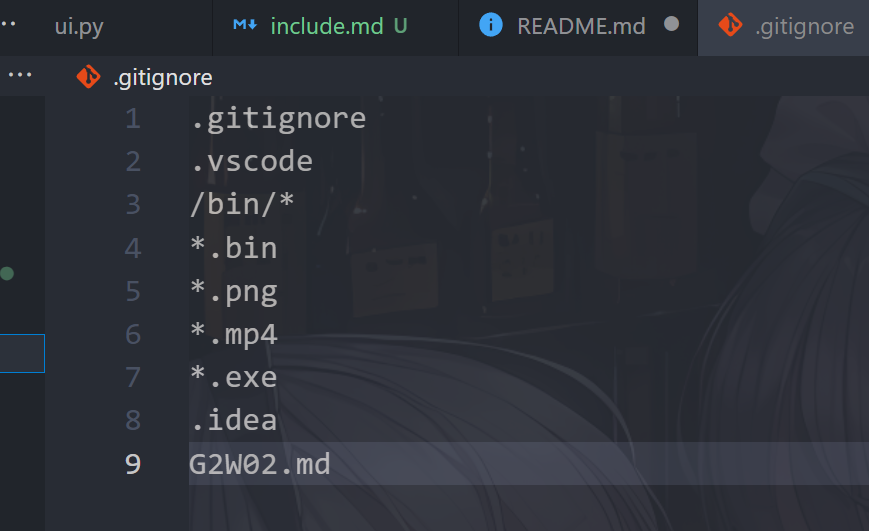

# 项目结构和提交说明
## 按照目录来交，不然后面找文件很麻烦
## include  
include是运行依赖项，像ffmpeg可执行文件可以在include下开个ffmpeg的目录来放ffmpeg的文件  
## assets
是运行中产生的临时文件存放的地方，按照目录来访对应文件找对应文件，不要随便指定生成文件的路径  
## src
放主要的源码，要是觉得不方便调用就到根目录开个文件夹自己放
## ffmpeg
封装调用ffmpeg
## 根目录
放比较重要的单文件
## 关于提交
不要上传和项目无关的文件，你们可以在本地根目录放个.gitignore来排除掉git提交检测，不要交的文件夹写在ignore里  

## 关于命名
用英文写个符合意思的


# netForViewLight
## 厦门大学软工系计网课程项目一  
### 项目结构  
ffmpeg存放调用ffmpeg的函数  
assets是存放缓存的视频图像文件的  
main是程序入口

这个还不完善，边做边加，暂时先这样，有想法提出大家一起看看  

### 函数注释说明  
eg：  
```
/*
    author:nnk
    para: #描述参数作用
        @a:加数
        @b:加数
    func:返回两数之和 #描述函数功能
*/
void add(int a,int b)   
{  
    return a+b;  
}  
```

### 提交说明
记得提交时写下修改了什么

### 没了

### 不要写下面这种
```
using namespace std;
```
